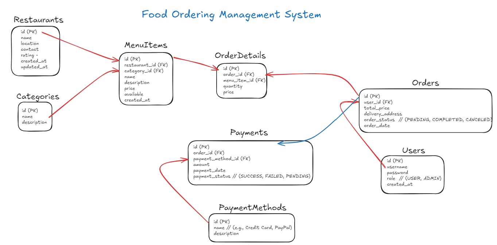
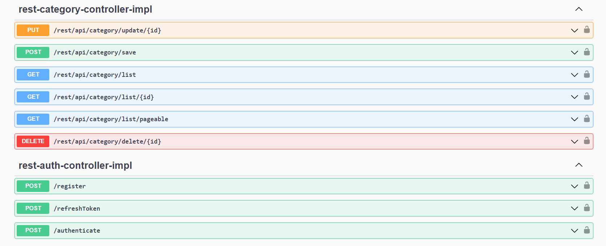

# 🍽️ Yemek Siparişi Yönetim Sistemi  

##  Genel Bakış    

  

## 🛠️ Teknolojiler  

- **Spring Boot**: RESTful API'ler geliştirmek için kullanıldı.  
- **Spring Security**: API güvenliği sağlamak için JWT ile kullanıcı doğrulaması ve refresh token mekanizması kullanıldı.   
- **JWT**: Kullanıcı doğrulaması için token tabanlı kimlik doğrulama ve refresh token ile süreli oturum yönetimi sağlandı.   
- **Swagger**: API belgeleri ve test arayüzü için kullanıldı.   
- **MapStruct**: Nesne eşleme için kullanıldı; DTO'lar ve entity'ler arasında dönüşüm işlemlerinde kullanılır.  
- **Pagination**: Veritabanı sorgularında büyük veri setlerinin sayfalama ile yönetilmesi, verinin tamamının çekilmemesi için kullanıldı.   
- **Global Exception Handling**: Uygulama genelinde merkezi hata yönetimi sağlandı.   
- **PostgreSQL**: Veritabanı olarak PostgreSQL tercih edildi.   

## 📡 API Endpoints  

  

Uygulama çalışmaya başladıktan sonra [http://localhost:8080/swagger-ui/](http://localhost:8080/swagger-ui/) adresine giderek API dokümantasyonuna erişebilirsiniz.  

> **Not**: JWT token'ları kullanıcı doğrulaması için kullanılır. Authorization başlığına "Bearer" ön eki ile token eklemeyi unutmayın. Ayrıca refresh token kullanılarak token yenilenebilir. 🔄  

> **PostgreSQL Veritabanı Yapılandırması**: Veritabanı yapılandırmalarını `src/main/resources/application.properties` dosyasındaki ayarlara göre düzenlemeyi unutmayın.  

---  

## 📄 Lisans  

Bu proje **MIT Lisansı** ile lisanslanmıştır. Daha fazla bilgi için LICENSE dosyasına göz atabilirsiniz.
